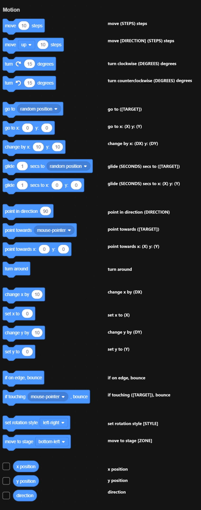

[BLOCKS](blocks.md)  
[MONITORS](monitors.md)  

# Opcodes
You do not have to define the "mode" property, it is automatically completed. The "mode" property is supposed to help you analyze inputs better.

## Motion


### `"move (STEPS) steps"`
```
{  
    "opcode": "move (STEPS) steps",
    "inputs": {
        "STEPS": {
            "mode": "block-and-text",
            "block": null,
            "text": "10"
        }
    },
    "options": {}
}
```
### `"move back (STEPS) steps"`  
This block is older and is not listed in the left bar.
```
{
    "opcode": "move back (STEPS) steps",
    "inputs": {
        "STEPS": {
            "mode": "block-and-text",
            "block": null,
            "text": "10"
        }
    },
    "options": {}
},
```
### `"move [DIRECTION] (STEPS) steps"`
`DIRECTION` must be either `"up"` or `"down"`.
```
{
    "opcode": "move [DIRECTION] (STEPS) steps",
    "inputs": {
        "STEPS": {
            "mode": "block-and-text",
            "block": null,
            "text": "10"
        }
    },
    "options": {
        "DIRECTION": "up"
    }
}
```
### `"turn clockwise (DEGREES) degrees"`
```
{
    "opcode": "turn clockwise (DEGREES) degrees",
    "inputs": {
        "DEGREES": {
            "mode": "block-and-text",
            "block": null,
            "text": "15"
        }
    },
    "options": {}
}
```
### `"turn counterclockwise (DEGREES) degrees"`
```
{
    "opcode": "turn counterclockwise (DEGREES) degrees",
    "inputs": {
        "DEGREES": {
            "mode": "block-and-text",
            "block": null,
            "text": "15"
        }
    },
    "options": {}
}
```
### `"goto ([TARGET])"`
`TARGET` must be either `"_random_"`(for a random position), `"_mouse_"`(for the mouse pointer) or the name of another sprite.
```
{
    "opcode": "goto ([TARGET])",
    "inputs": {
        "TARGET": {
            "mode": "block-and-option",
            "block": null,
            "option": "_random_"
        }
    },
    "options": {}
}
```  
### `"go to x: (X) y: (Y)"`
```
{
    "opcode": "go to x: (X) y: (Y)",
    "inputs": {
        "X": {
            "mode": "block-and-text",
            "block": null,
            "text": "0"
        },
        "Y": {
            "mode": "block-and-text",
            "block": null,
            "text": "0"
        }
    },
    "options": {}
}
```  
### `"change by x: (DX) y: (DY)"`
```
{
    "opcode": "change by x: (DX) y: (DY)",
    "inputs": {
        "DX": {
            "mode": "block-and-text",
            "block": null,
            "text": "10"
        },
        "DY": {
            "mode": "block-and-text",
            "block": null,
            "text": "10"
        }
    },
    "options": {}
}
```  
### `"glide (SECONDS) secs to ([TARGET])"`
`TARGET` must be either `"_random_"`(for a random position), `"_mouse_"`(for the mouse pointer) or the name of another sprite.
```
{
    "opcode": "glide (SECONDS) secs to ([TARGET])",
    "inputs": {
        "SECONDS": {
            "mode": "block-and-text",
            "block": null,
            "text": "1"
        },
        "TARGET": {
            "mode": "block-and-option",
            "block": null,
            "option": "_random_"
        }
    },
    "options": {}
}
```  
### `"glide (SECONDS) secs to x: (X) y: (Y)"`
```
{
    "opcode": "glide (SECONDS) secs to x: (X) y: (Y)",
    "inputs": {
        "SECONDS": {
            "mode": "block-and-text",
            "block": null,
            "text": "1"
        },
        "X": {
            "mode": "block-and-text",
            "block": null,
            "text": "192"
        },
        "Y": {
            "mode": "block-and-text",
            "block": null,
            "text": "0"
        }
    },
    "options": {}
}
```  
### `"point in direction (DIRECTION)"`
```
{
    "opcode": "point in direction (DIRECTION)",
    "inputs": {
        "DIRECTION": {
            "mode": "block-and-text",
            "block": null,
            "text": "90"
        }
    },
    "options": {}
}
```  
### `"point towards ([TARGET])"`
`TARGET` must be either `"_random_"`(for a random position), `"_mouse_"`(for the mouse pointer) or the name of another sprite.
```
{
    "opcode": "point towards ([TARGET])",
    "inputs": {
        "TARGET": {
            "mode": "block-and-option",
            "block": null,
            "option": "_mouse_"
        }
    },
    "options": {}
}
```  
### `"point towards x: (X) y: (Y)"`
```
{
    "opcode": "point towards x: (X) y: (Y)",
    "inputs": {
        "X": {
            "mode": "block-and-text",
            "block": null,
            "text": "0"
        },
        "Y": {
            "mode": "block-and-text",
            "block": null,
            "text": "0"
        }
    },
    "options": {}
}
```  
### `"turn around"`
```
{
    "opcode": "turn around",
    "inputs": {},
    "options": {}
}
```  
### `"change x by (DX)"`
```
{
    "opcode": "change x by (DX)",
    "inputs": {
        "DX": {
            "mode": "block-and-text",
            "block": null,
            "text": "10"
        }
    },
    "options": {}
}
```  
### `"set x to (X)"`
```
{
    "opcode": "set x to (X)",
    "inputs": {
        "X": {
            "mode": "block-and-text",
            "block": null,
            "text": "83"
        }
    },
    "options": {}
}
```  
### `"change y by (DY)"`
```
{
    "opcode": "change y by (DY)",
    "inputs": {
        "DY": {
            "mode": "block-and-text",
            "block": null,
            "text": "10"
        }
    },
    "options": {}
}
```  
### `"set y to (Y)"`
```
{
    "opcode": "set y to (Y)",
    "inputs": {
        "Y": {
            "mode": "block-and-text",
            "block": null,
            "text": "39"
        }
    },
    "options": {}
},
```  
### `"if on edge, bounce"`
```
{
    "opcode": "if on edge, bounce",
    "inputs": {},
    "options": {}
},
```  
### `"if touching ([TARGET]), bounce"`
`TARGET` must be either `"_random_"`(for a random position), `"_mouse_"`(for the mouse pointer) or the name of another sprite.
```
{
    "opcode": "if touching ([TARGET]), bounce",
    "inputs": {
        "TARGET": {
            "mode": "block-and-option",
            "block": null,
            "option": "_mouse_"
        }
    },
    "options": {}
}
```  
### `"set rotation style [STYLE]"`
`STYLE` must be either `"left-right"`, `"up-down"`, `"look at"`, `"don't rotate"` or `"all around"`.
```
{
    "opcode": "set rotation style [STYLE]",
    "inputs": {},
    "options": {
        "STYLE": "left-right"
    }
}
```  
### `"move to stage [ZONE]"`
`ZONE` must be either `"bottom-left"`, `"bottom"`, `"bottom-right"`, `"top-left"`, `"top"`, `"top-right"`, `"left"` or `"right"`.
```
{
    "opcode": "move to stage [ZONE]",
    "inputs": {},
    "options": {
        "ZONE": "bottom-left"
    }
}
```
### `"x position"`
```
{
    "opcode": "x position",
    "inputs": {},
    "options": {}
}
```
### `"y position"`
```
{
    "opcode": "y position",
    "inputs": {},
    "options": {}
}
```
### `"direction"`
```
{
    "opcode": "direction",
    "inputs": {},
    "options": {}
}
```

## Temporary
```
move (STEPS) steps


move [DIRECTION] (STEPS) steps


turn clockwise (DEGREES) degrees


turn counterclockwise (DEGREES) degrees


go to ([TARGET])


go to x: (X) y: (Y)


change by x: (DX) y: (DY)


glide (SECONDS) secs to ([TARGET])


glide (SECONDS) secs to x: (X) y: (Y)


point in direction (DIRECTION)


point towards ([TARGET])


point towards x: (X) y: (Y)


turn around


change x by (DX)


set x to (X)


change y by (DY)


set y to (Y)


if on edge, bounce


if touching ([TARGET]), bounce


set rotation style [STYLE]


move to stage [ZONE]


x position

y position

direction
```