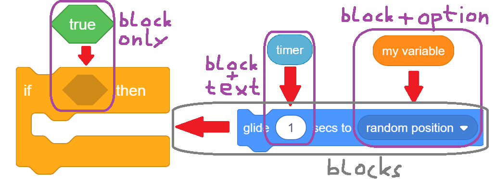

[BACK](sprites.md)

# What a script looks like
Must be an object with the following properties:
| **property** | **type**         | **description**                                                   
|--------------|------------------|-------------------------------------------------------------------
| `"position"` | array coordinate | The position of the first block of the script in the coding space.
| `"blocks"`   | array of objects | The blocks of the script in order from top to bottom.             

### Example
```
{"position": [50, 100], "blocks": [
    {"opcode": "next costume"},
    {"opcode": "show"},
]}
```
<pre class="blocks">
next costume
show
</pre>

# What a block looks like
A Block must be an object with the following properties. 
| **property** | **type**       | **optional?** | **description**                                                             
|--------------|----------------|---------------|-----------------------------------------------------------------------------
| `"opcode"`   | string         | no            | The name of the block. [Opcodes (SOON)]() e.g. `"set [VARIABLE] to (VALUE)"`
| `"inputs"`   | object         | yes           | The inputs of the block. [Docs](#what-inputs-looks-like)                    
| `"options"`  | object         | yes           | The dropdowns of the block. [Docs](#what-options-looks-like)                
| `"comment"`  | null \| object | yes           | The comment of the block. Must be either `null` or a [Comment](comments.md) 


### Example
```
{
    "opcode": "say (MESSAGE) for (SECONDS) seconds",
    "inputs": {
        "MESSAGE": {"block": null, "text": "Hello!"},
        "SECONDS": {
            "block": {
                "opcode": "timer"
            },
            "text": "2"
        },
    },
}
```
<pre class="blocks">
say [Hello!] for (timer) seconds
</pre>

# What inputs looks like
### Each block has its own inputs. There are 5 kinds of inputs:
* **`"block-and-text"`**: An input, which has a text and optionally a block on top of the text. 
    - eg. `{"block": {"opcode": "timer"}, "text": "1"}`

* **[RARE]`"block-and-menu-text"`** An input which contains a menu block with only one valid `"opcode"`  
    - eg. `{"block": {"opcode": "polygon" ...}}`

* **`"block-only"`**: An input which may contain a block(often used for boolean inputs). 
    - eg. `{"block": {"opcode": "true"}}`

* **`"script"`**: An input which contains a substack of blocks.  
    - eg. `{"blocks": [  {"opcode": "glide (SECONDS) secs to ([TARGET])" ...}  ]}`

* **`"block-and-option"`/`"block-and-broadcast-option"`**: An input which has a dropdown and optionally a block on top.
    - eg, `{"block": {"opcode": "value of [VARIABLE]" ...}, "option": "random position"}`



<pre class="blocks">
if &lt;true::operators&gt; then
    glide (timer) secs to (my variable)
end
</pre>
```
{
    "opcode": "if <CONDITION> then {THEN}",
    "inputs": {
        "CONDITION": {"block": {
            "opcode": "true",
        }},
        "THEN" {"blocks": [
            {
                "opcode": "glide (SECONDS) secs to ([TARGET])",
                "inputs": {
                    "SECONDS": {"block": {
                        "opcode": "timer",
                    }},
                    "TARGET": {"block": (see setting option example)},
                },
            },
        ]},
    },
}
```
# What options look like
Options are an array containing a prefix and a value eg. `["variable", "my variable"]`
The prefix is depends on the parent block and the value is custom. Just try it out. The validator will correct you. You can also take option values directly from the Penguinmod website.
### There are two kinds of options:
* **Dropdown Options**: Visible and square-shaped dropdowns.
    <pre class="blocks">
    set drag mode to [draggable v]::sensing
    </pre>
    ```
    {
        "opcode": "set drag mode [MODE]",
        "options": {
            "MODE": ["value", "draggable"],
        },
    }
    ```
* **Setting Options**: Invsible options that determine the behaviour of blocks.
    <pre class="blocks">
    (my variable)
    </pre>
    ```
    {
        "opcode": "value of [VARIABLE]",
        "options": {
            "VARIABLE": ["variable", "my variable"],        
        },
    }
    ```

<script src="../scratchblocks_renderer.js"></script>
<script>
scratchblocks.renderMatching('pre.blocks', {
    style:     'scratch3',
    languages: ["en"],
    scale: 1,
});
</script>

