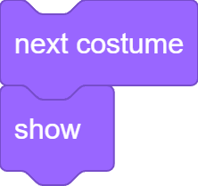
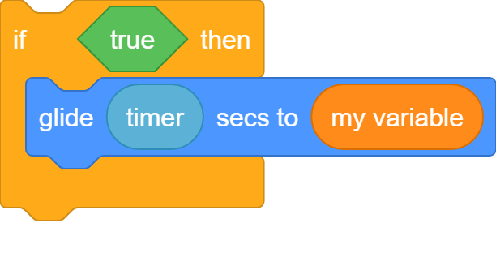
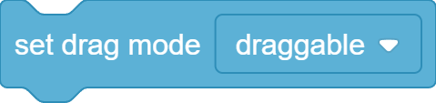

[BACK](sprites.md)

# What a script looks like
### Must be an object with the following properties:
* **`"position"`**: The position of the first block of the script in the coding space.
* **`"blocks"`**: The blocks of the script in order from top to bottom.
### Example

```
{"position": [50, 100], "blocks": [
    {"opcode": "next costume"},
    {"opcode": "show"},
]}
```

# What a block looks like
### A Block must be an object with the following properties. 
* **`"opcode"`**: The name of the block. [Opcodes (SOON)]() e.g. `"set [VARIABLE] to (VALUE)"`
### Optional Properties
* **`"inputs"`**: The inputs of the block. [Docs](#what-inputs-looks-like)
* **`"options"`**: The dropdowns of the block. [Docs](#what-options-looks-like)
* **`"comment"`**: The comment of the block. Must be either `null` or a [Comment](comments.md)
## Example

```
{
    "opcode": "say (MESSAGE) for (SECONDS) seconds",
    "inputs": {
        "MESSAGE": {"block": null, "text": "Hello!"},
        "SECONDS": {
            "block": {
                "opcode": "timer"
            },
            "text": "2"
        },
    },
}
```

# What inputs looks like
### Each block has its own inputs. There are 5 kinds of inputs:
* **`"block-and-text"`**: An input, which has a text and optionally a block on top of the text.  
    - eg. `{"block": {"opcode": "timer"}, "text": "1"}`
* **[RARE]`"block-and-menu-text"`** An input which contains a menu block with only one valid `"opcode"`  
    - eg. `{"block": {"opcode": "polygon" ...}}`
* **`"block-only"`**: An input which may contain a block(often used for boolean inputs). 
    - eg. `{"block": {"opcode": "true"}}`
* **`"script"`**: An input which contains a substack of blocks.  
    - eg. `{"blocks": [  {"opcode": "glide (SECONDS) secs to ([TARGET])" ...}  ]}`
* **`"block-and-option"`/`"block-and-broadcast-option"`**: An input which has a dropdown and optionally a block on top.
    - eg, `{"block": }`



```
{
    "opcode": "if <CONDITION> then {THEN}",
    "inputs": {
        "CONDITION": {"block": {
            "opcode": "true",
        }},
        "THEN" {"blocks": [
            {
                "opcode": "glide (SECONDS) secs to ([TARGET])",
                "inputs": {
                    "SECONDS": {"block": {
                        "opcode": "timer",
                    }},
                    "TARGET": {"block": (see example below)},
                },
            },
        ]},
    },
}
```
# What options look like
### Options are an array containing a prefix and a value eg. `["variable", "my variable"]`
The prefix is depends on the parent block and the value is custom. Just try it out. The validator will correct you. You can also take option values directly from the Penguinmod website.
### There are two kinds of options:
* **Dropdown Options**: Visible and square-shaped dropdowns.

```
{
    "opcode": "set drag mode [MODE]",
    "options": {
        "MODE": ["value", "draggable"],
    },
}
```
* **Setting Options**: Invsible options that determine the behaviour of blocks.

```
{
    "opcode": "value of [VARIABLE]",
    "options": {
        "VARIABLE": ["variable", "my variable"],        
    },
}
```
